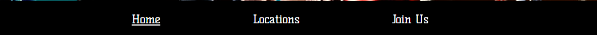

...Just sports...

Lot of peope woul like to doo some sports and dont wannt to get cougt up in boring routine of trinig or repeting allways the same execises, gooing to same places, dooing all the same stuff ower and ower agin.
Our goal is to connect people of one comunity to meet up and train/play all kinds of sports together. We play vereity of sports on diferent locations and making it so interesting to come and have fun with people with the same goal.

User of the website will be able to see our location and times wann we meetup, reigstering to our page user wwould get informations on our next meetuops or some tournements wich our user could join.

Features

Navigation

    Navigation
        Fetaurd und our cover image with diferent players center align is our nav bar with underlined Home witch shows us on witch page are we currently on and by clicking it taking us on top of our homepage.
        The other elements in nav bar are Locations and Join Us witch take us to other pages.
        Navigation is in font similar to thos used for energy drinks witch complements the paion for spots.
        Navigation tells clearly wheere we are and what content we cann find on our webpage.

 

    The Header
        The header shows the simple title ...just sports... followd by imperative message to respecto your body and indications ther later on user cann find out what is it about.
        The header shows its clearly for sports only, profesional adult athlets indicates its not for kids.
        Section provides all the information after first impression given in header.

    Section
        In section is our main content with intiguing title 4w4u following by 4 sections with 4 w questins, why, what, who, where with small intro to explanation, each one expands on hover and in every one are further information eventually givin the full information about all there is about our topic.
        This section, gives all necessary information obut our page and our goals.

     

    Locations
        Second page of our webpage is locations section with all locations where and wenn we meat and what we play.
        Locations page has 6 boxes with locations and every box hat iframe google maps with exact lokation of meetup, it convinient to users in cars allowing them to find location fast in cases wwhere they are driving.

    Join us
        The join us page has a form to collect details from users so they can be a member and join us on trainings.
        Form collects the users name, surname, email, and year of birth.
        Its importan to register because the traingns are for members only and memebers get information such es if locatins are changed or if we organise or participate in turnament or someting of similat content.

        Next to form is one motivational video to convice the users witch are still not shure if they want ot join us or not.

  

    Social Media
        In footer are our social media links to take our users on our social media sites where are reguraly postet pictures of our meetups and trainings.
        Links are colored green on hover and all links open in new tab.

   

Testing

    I tested this page in different browsers Chrome, Firefox, Edge.

    I confirmed that this project is, looks good and functins on all standard screen sizes using the dectools device toolbar.

    I confirmed that the nacigationa, header, locatons, sign up, section and footer are all readable and easy to understand.

    I confirmed that thr form woeks: requires enteries in every field, will only accept an email in the email field, and the submit button works.

Bugs

    
